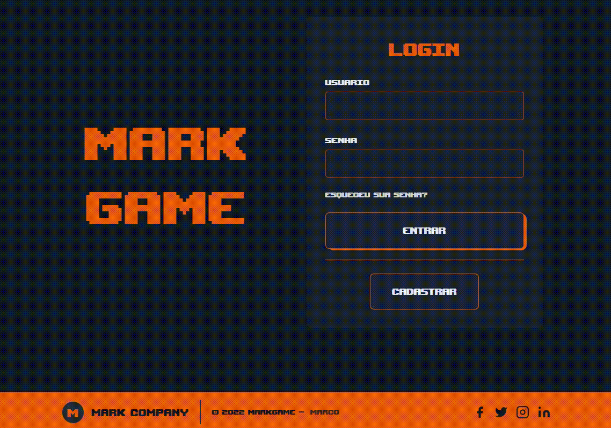

<h1 name='nome-do-projeto' align="center">MarkGame</h1>

<h4 align="center">
  <a href="#Projeto" >
    Projeto
  </a>
  |
  <a href="#Deploy" >
    Deploy
  </a>
  |
  <a href="#Tecnologias" >
    Tecnologias
  </a>
  |
  <a href="#Licença" >
    Licença
  </a>
</h4>

 
<h2 name="Projeto">📃 Projeto</h2>

MarkGame é um jogo de perguntas e respostas baseada em conhecimentos gerais, também possui dois tipos de ranqueamento, ordenados por acertos ou total de respostas.
 
 

  

 
 
<h2 name="Deploy">🚀 Deploy</h2>

O deploy do front-end foi feito em 2 serviços diferentes:
|Serviço|URL|
| -------- | ----------------------------- |
| Firebase | https://mark-game.web.app/    |
| Netlify  | https://markgame.netlify.app/ |

Já o back-end está hospedado no Heroku.

 
 
<h2 name="Tecnologias">💻 Tecnologias</h2>

Esse projeto foi desenvolvido com as seguintes tecnologias:

🖌️ Front-End

- React
- Context API
- JavaScript
- HTML
- Tailwind CSS

⚙️ Back-End

- Laravel
- Artisan Console
- Eloquent ORM
- MySQL
- Padrão MVC

 
 

<h2>Padrão de commit</h2>

|Emoji|Tipo de Commit|
|-----|-----------|
|:tada:|first commit|
|:art:|quando melhorar a estrutura do código|
|:memo:|quando escrever alguma documentação|
|:bug:|quando corrigir um bug|
|:fire:|quando remover códigos ou arquivos|
|:lock:|quando melhorar a segurança|
|:construction:|em construção|
|:rocket:|nova feature|
|:see_no_evil:|gambiarra|
|:gift:|nova versão|

<h5>Criado por: <a href='https://gist.github.com/crissilvaeng/dfb5b14f8eb2c25df4fd8a49f4f03252'>crissilvaeng</a></h5>

 
 
<h2 name="Licença">📝 Licença</h2>

Esse projeto está sob licença. Veja o arquivo [LICENSE](LICENSE) para mais detalhes.

 
 

[⬆ Voltar ao topo](#nome-do-projeto) 
